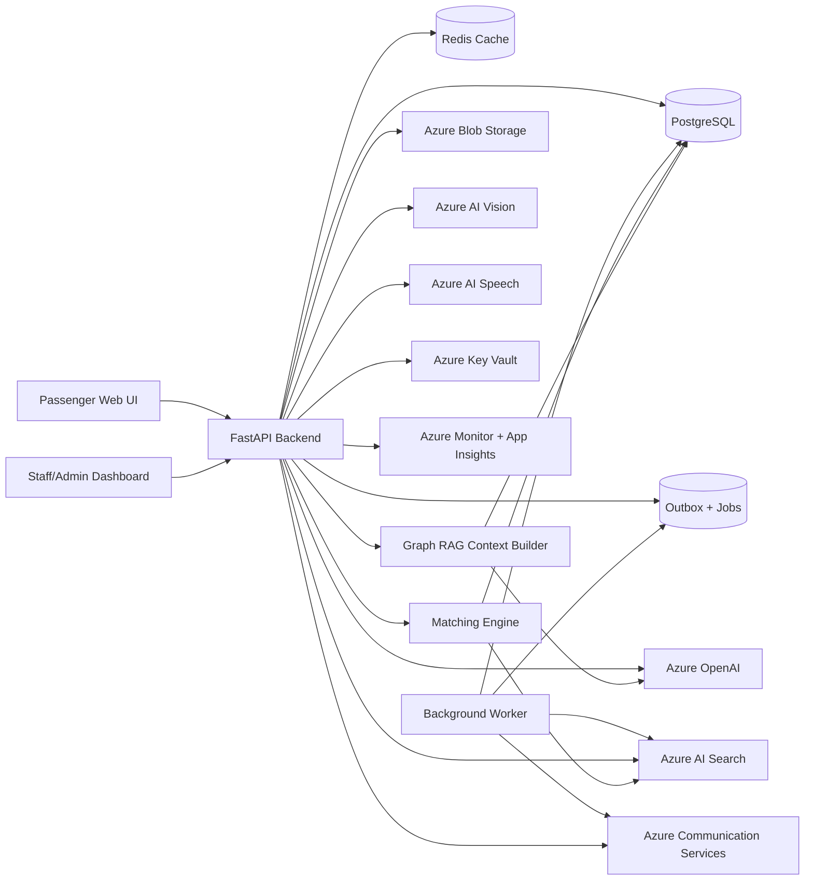

# AI-Powered Lost & Found System for Airport Operations

An Azure-native full-stack MVP for airport lost and found operations. Passengers submit reports directly or through a chatbot, staff register found items with images, AI enriches item profiles, the matching engine creates candidates, and staff manually approve outcomes before release.

## Features
- Passenger lost report form and guided chatbot intake.
- Passenger chatbot voice mode with browser microphone input, spoken replies, and Azure Speech-ready token endpoint.
- Arabic/English chatbot sessions for guided report intake and safe status updates.
- Safe passenger status lookup with report code plus contact verification.
- Staff found item registration, AI image/OCR enrichment, matching, review, and custody timeline.
- Claim verification, fraud-risk scoring, release checklist, and QR custody label scanning.
- Immutable audit logs for sensitive staff, custody, claim, release, and label actions.
- Graph RAG evidence summaries that connect matches to reports, found items, claims, custody, QR scans, and audit activity.
- Admin analytics, users, locations, categories, and system settings pages.
- Admin operations console for deep health, background jobs, outbox monitoring, and provider configuration.
- Local-first Azure service adapters for OpenAI, AI Search, Blob Storage, Vision, Communication Services, Redis, Key Vault, and observability.
- Hardened JWT authentication with refresh tokens, logout revocation, account lockout, password reset hooks, RBAC, rate limits, upload validation, PII masking, and manual approval gates.

## Architecture


## Azure Services Used
- Azure OpenAI: description cleanup, attribute extraction, embeddings, match summaries, chatbot follow-up questions, and model routing by workload.
- Azure AI Search: hybrid search, keyword search, vector search, filtering, candidate retrieval.
- Azure Blob Storage: found item images, proof documents, uploaded photos, secure URL generation.
- Azure AI Vision: image tags, captions, object detection, OCR.
- Azure Managed Redis or Azure Cache for Redis: AI/status/analytics caching.
- Azure Communication Services: email and SMS notifications.
- Azure AI Speech: optional production speech token flow for browser STT/TTS upgrades.
- Azure Key Vault: secrets for production deployments.
- Azure Container Apps: backend and optional frontend hosting.
- Azure Monitor and Application Insights: logs, traces, metrics, latency, AI/search/blob call tracking.

## Local Setup
1. Copy `.env.example` to `.env`.
2. Keep `USE_AZURE_SERVICES=false` for local mock adapters.
3. Run:
```bash
docker compose up --build
```
4. Open:
   - Frontend: http://localhost:5173
   - Backend docs: http://localhost:8000/docs

Docker Compose starts `backend`, `worker`, `frontend`, `postgres`, and `redis`. The backend applies Alembic migrations and seeds demo data in local mode.

Demo accounts:
- `admin@airport-demo.com` / `Password123!`
- `mona.staff@airport-demo.com` / `Password123!`
- `passenger1@airport-demo.com` / `Password123!`

## Azure Setup
Provision Azure Database for PostgreSQL, Azure Redis, Azure OpenAI deployments, Azure AI Search, Blob Storage, AI Vision, Communication Services, Key Vault, Application Insights, and Container Apps. The Bicep template in `infra/` deploys the Container Apps environment plus common supporting resources and wires Key Vault-backed secrets into the backend container.

Set `USE_AZURE_SERVICES=true` and configure the Azure variables from `.env.example`. Use separate resource groups, Key Vaults, PostgreSQL databases, Redis instances, Container Apps, and App Insights resources for staging and production.

For Azure deployment:
```powershell
Copy-Item infra/main.parameters.example.json infra/main.parameters.json
# Fill real image names, passwords, Azure OpenAI/Vision/Communication values.
./infra/deploy.ps1 -ResourceGroup airport-lost-found-rg -Location eastus -ParametersFile ./infra/main.parameters.json
```

The backend can also load secrets directly from Key Vault at startup when `AZURE_KEY_VAULT_URL` is set. Default secret names use environment-variable names with hyphens, for example:
- `DATABASE-URL`
- `JWT-SECRET`
- `AZURE-OPENAI-API-KEY`
- `AZURE-STORAGE-CONNECTION-STRING`
- `AZURE-AI-VISION-KEY`
- `AZURE-SEARCH-KEY`
- `AZURE-COMMUNICATION-CONNECTION-STRING`
- `APPLICATIONINSIGHTS-CONNECTION-STRING`

## Environment Variables
See `.env.example` for the complete list. Key local variables are:
- `DATABASE_URL`
- `JWT_SECRET`
- `ACCESS_TOKEN_EXPIRE_MINUTES`
- `REFRESH_TOKEN_EXPIRE_DAYS`
- `ACCOUNT_LOCKOUT_THRESHOLD`
- `RATE_LIMIT_LOGIN_PER_MINUTE`
- `RATE_LIMIT_PUBLIC_PER_MINUTE`
- `RATE_LIMIT_AI_PER_MINUTE`
- `RATE_LIMIT_UPLOAD_PER_MINUTE`
- `REDIS_URL`
- `CACHE_BACKEND`
- `USE_AZURE_SERVICES`
- `VITE_API_URL`
- `AZURE_KEY_VAULT_URL`
- `AZURE_OPENAI_FAST_DEPLOYMENT`
- `AZURE_OPENAI_REASONING_DEPLOYMENT`
- `AZURE_OPENAI_DEEP_REASONING_DEPLOYMENT`
- `AZURE_SEARCH_VECTOR_DIMENSIONS`
- `VOICE_FEATURES_ENABLED`
- `VOICE_PROVIDER`
- `AZURE_SPEECH_KEY`
- `AZURE_SPEECH_REGION`
- `QR_LABEL_BASE_URL`
- `FRAUD_HIGH_RISK_THRESHOLD`
- `GRAPH_RAG_ENABLED`
- `GRAPH_RAG_PROVIDER`
- `AZURE_COSMOS_GREMLIN_ENDPOINT`
- `AZURE_COSMOS_GREMLIN_KEY`
- `WORKER_POLL_INTERVAL_SECONDS`
- `OUTBOX_MAX_ATTEMPTS`
- `PROOF_DOCUMENT_RETENTION_DAYS`

Azure OpenAI routing is optional but recommended in production:
- Fast route: `AZURE_OPENAI_FAST_*` for cleanup, attribute extraction, chatbot follow-up questions, and other high-volume calls.
- Reasoning route: `AZURE_OPENAI_REASONING_*` for match evidence and Graph RAG summaries.
- Deep route: `AZURE_OPENAI_DEEP_REASONING_*` reserved for heavier staff-assistance workflows that need the strongest model.

If a route-specific endpoint or key is omitted, the backend falls back to the main `AZURE_OPENAI_ENDPOINT` and `AZURE_OPENAI_API_KEY`. AI cache keys include the deployment name so model changes do not reuse stale cached outputs.

Set `AZURE_OPENAI_USE_RESPONSES_API=true` only when the configured Azure OpenAI resource supports the Responses API for those deployments. Otherwise the backend uses Chat Completions directly to avoid a fallback retry on every request.

## Backend
```bash
cd backend
pip install -r requirements.txt -r requirements-dev.txt
alembic upgrade head
python -m app.scripts.seed
uvicorn app.main:app --reload
```

## Frontend
```bash
cd frontend
npm install
npm run dev
```

## Migrations
```bash
cd backend
alembic upgrade head
```

The first MVP migration created the initial schema from SQLAlchemy metadata. Production-hardening migrations are deterministic and additive going forward, with CI running `alembic upgrade head` against PostgreSQL before deployment.

## Seed Data
```bash
cd backend
python -m app.scripts.seed
```

Seed data includes 1 admin, 3 staff/security users, 5 passengers, 10 locations, 10 categories, 20 found items, 20 lost reports, custody events, notifications, realistic match candidates, claim verification examples, QR labels, fraud-risk examples, and audit events.

## Matching Engine
Final score is 0 to 100:
- Azure AI Search hybrid/vector similarity: 30%
- Category match: 15%
- Text similarity: 15%
- Color match: 10%
- Location similarity: 10%
- Time proximity: 10%
- Flight number match: 5%
- Unique identifier match: 5%

Special rules boost exact identifiers, penalize identifier conflicts, cap very different categories, reduce score when found time precedes lost time, and require manual approval for high-value, sensitive, and dangerous items.

Confidence bands:
- 85 to 100: high
- 70 to 84: medium
- 50 to 69: low
- Below 50: not saved

## Chatbot
The passenger chatbot supports report creation and status checks in English or Arabic. Status requires a report code and matching email or phone. Responses are privacy-safe and do not expose full found-item details before staff verification. In Azure mode, Azure OpenAI generates follow-up questions from the current collected fields; local mode uses deterministic fallback questions.

Voice mode uses the browser microphone and speech synthesis APIs for the MVP. The backend exposes `/voice/token` so production deployments can switch `VOICE_PROVIDER=azure` and return short-lived Azure Speech tokens without exposing the Speech key to the browser.

## Claim Verification And Release
Staff can create a claim verification from a match candidate. The system records passenger answers, proof blob references, fraud-risk score, review notes, checklist completion, and release metadata. A release requires an approved claim and a completed checklist:
- identity checked
- proof checked
- passenger signed
- custody updated

Release updates the found item to `released`, the lost report to `resolved`, approves the match candidate, and writes a custody event plus audit log.

## QR Custody Labels
Found item detail pages can generate active QR labels. Staff can scan labels from `/staff/scan` using the browser camera when `BarcodeDetector` is available, or enter the label code manually. Every scan increments the label count, adds a custody note, and writes an audit log.

## Fraud Risk
Fraud scoring is rule-based for the MVP. It considers match score, item risk level, contact mismatch, identifier conflicts, repeated rejected/blocked claims, and incomplete evidence answers. Fraud-risk analytics are exposed at `/analytics/fraud-risk` and cached through Redis.

## Graph RAG
Graph RAG is implemented as a Postgres-backed graph context builder for the MVP. It converts existing operational records into graph nodes and edges, retrieves the neighborhood around a match, found item, or lost report, and summarizes that relationship evidence for staff.

Endpoints:
- `GET /graph-rag/matches/{match_id}`
- `POST /graph-rag/matches/{match_id}/explain`
- `GET /graph-rag/found-items/{item_id}`
- `GET /graph-rag/lost-reports/{report_id}`

The graph currently includes lost reports, found items, match candidates, passengers with masked contact metadata, categories, locations, flights, claim verifications, custody events, QR labels, and audit logs. Local mode uses deterministic summaries; Azure mode uses Azure OpenAI for concise graph evidence summaries. Optional Cosmos DB Gremlin settings are included for a future persistent graph store.

## Caching
Redis is used locally and in Azure mode, with in-memory fallback for tests. The backend caches sanitized AI results, localized passenger status responses, analytics summaries, fraud-risk summaries, graph context summaries, and safe match previews. Report, item, match, claim, release, label scan, and custody mutations invalidate operational caches.

## Production Pilot Hardening
The pilot build adds refresh tokens, token revocation on logout/password reset, password strength validation, account lockout, staff/admin MFA verification hooks, auth audit logs, rate limits, idempotency keys for critical writes, malware-scan adapter hooks, stronger MIME signature checks, and private blob/SAS access patterns.

Critical write paths accept `Idempotency-Key` headers so clients can safely retry lost report creation, found item creation, match approval, and release actions without duplicate operational records.

## Background Jobs And Outbox
The app now includes `outbox_events` and `background_jobs` tables plus a worker process:

```bash
cd backend
python -m app.scripts.worker
```

Docker Compose runs the worker automatically. The current pilot still performs immediate AI/search operations inline where the user needs the result, while also recording durable outbox/job entries for retry, monitoring, and the next async-processing step.

## Health And Operations
- `GET /health/live`: process liveness.
- `GET /health/ready`: basic API readiness.
- `GET /health/ready/deep`: Postgres, Redis, Blob mode, Search mode, outbox, worker queue, and provider configuration checks.
- `GET /admin/jobs`: background job monitoring.
- `POST /admin/jobs/{id}/retry`: retry failed/dead-letter jobs.
- `GET /admin/outbox`: durable event monitoring.
- `POST /admin/search/recreate-index`: recreate the Azure AI Search index schema.
- `POST /admin/search/reindex-lost-reports`: push all lost reports back into search.
- `POST /admin/search/reindex-found-items`: push all active found items back into search.
- `POST /admin/search/reindex-all?recreate_index=true`: recreate the index and repopulate all search documents.
- `POST /admin/matching/rerun-all`: rerun candidate matching for active lost reports. Add `?limit=1` for a small smoke test.
- `POST /admin/data-retention/run`: conservative transcript retention cleanup.
- `POST /admin/users/{id}/disable`: disable an account with audit logging.
- `GET /admin/users/{id}/data-export`: passenger data discovery for privacy requests.
- `POST /admin/users/{id}/privacy-delete`: conservative passenger anonymization workflow.

The frontend Admin > Operations page surfaces deep health, provider status, queue backlog, outbox backlog, and job retry actions.

## Observability
The backend emits structured JSON logs with request IDs. OpenTelemetry instrumentation is configured for FastAPI, SQLAlchemy, HTTP clients, and Azure Monitor/Application Insights when telemetry connection settings are present. Logs and traces redact passwords, tokens, phone numbers, serial-like identifiers, transcripts, raw prompts, proof URLs, and other sensitive fields.

AI usage is tracked in Redis-backed analytics at `/analytics/ai-usage`, including request counts, token totals, and optional estimated cost when the `AZURE_OPENAI_*_COST_PER_1K` variables are configured.

Operational logs include cache hit/miss, AI token usage, match outcomes, fraud score, worker processing counts, API latency, and failed dependency signals. Use Application Insights dashboards and alerts for latency, error rate, failed Azure calls, notification failures, dead-letter backlog, AI usage/cost, release rate, and fraud-score distribution.

## CI/CD
The GitHub Actions workflow runs backend compile/tests, Alembic migration smoke tests against PostgreSQL, frontend production build, and Docker build smoke tests before deployment. Deployment is gated behind the test job and targets Azure Container Apps with Key Vault-backed secrets.

For pilot operations, deploy to staging first, validate `/health/ready/deep`, run a small API smoke test, then promote the same image tag to production.

## Runbooks
Operational runbooks live in [docs/runbooks/production-pilot-runbooks.md](docs/runbooks/production-pilot-runbooks.md) and cover failed indexing, failed notifications, stuck jobs, incident triage, backup/restore, rollback, and release gates.

## Azure AI Search
When `USE_AZURE_SERVICES=true`, startup creates or updates the configured Azure AI Search index. Lost reports and found items are pushed as searchable documents with:
- text fields for keyword/hybrid search
- filter fields for source type, category, location, status, risk, and time
- `content_vector` for vector search

Candidate matching uses Azure AI Search hybrid vector/text results first, then applies the local business-rule scoring engine.

## Security And Privacy
- Passwords are hashed.
- JWT protects private APIs.
- RBAC separates passenger, staff, admin, and security actions.
- Production/staging startup validates non-default secrets, explicit CORS origins, explicit host allow-lists, and HTTPS enforcement.
- Trusted host checks use `ALLOWED_HOSTS`.
- Security response headers are enabled by default with `SECURITY_HEADERS_ENABLED=true`.
- HTTPS redirect can be enforced with `FORCE_HTTPS=true` behind production ingress.
- Uploads validate file type and size.
- Local URLs are used only in development; Azure mode uses secure blob access patterns.
- Passenger status checks expose limited information only.
- Custody and review actions create operational audit records.
- Claim verification and release actions create immutable audit records.
- QR scan events create custody notes without exposing passenger PII.
- Manual approval is required before release.

## Automated Tests
Backend tests cover security masking/password/MFA helpers, security headers and production config validation, idempotency, Graph RAG privacy, and matching-engine edge cases:

```bash
cd backend
pytest
```

Frontend smoke tests verify critical public, staff, and admin routes plus operations endpoints, then run the TypeScript production build:

```bash
cd frontend
npm test
```

## Future Improvements
- WhatsApp integration.
- CCTV-assisted lost item detection.
- RFID shelf tracking.
- Power BI dashboard.
- Airport police workflow.
- Airline baggage system integration.
- Fraud detection for suspicious claims.
- Additional passenger languages beyond Arabic and English.
