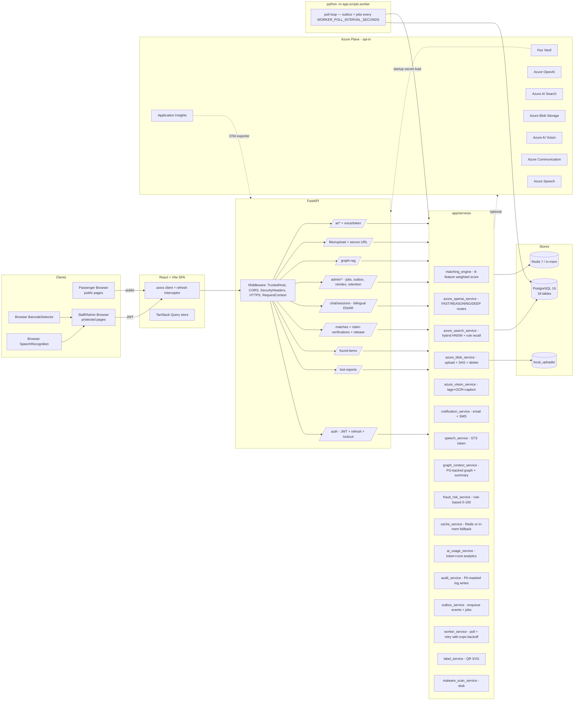
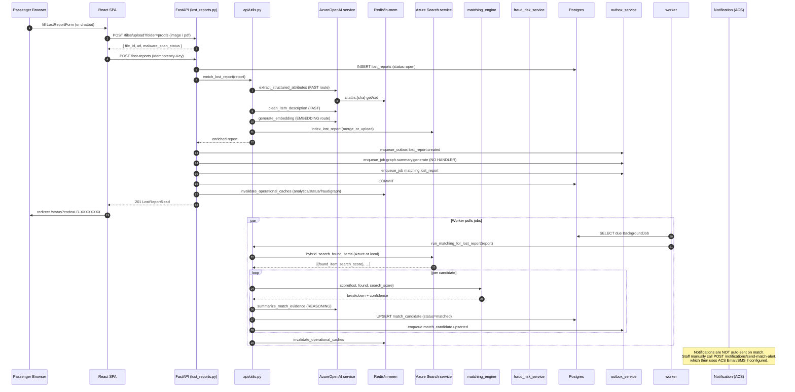
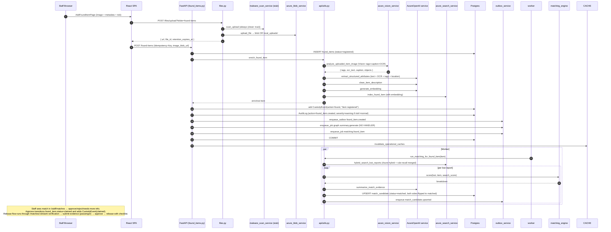

# CODEBASE_MAP — AI-Powered Lost & Found System for Airport Operations

> Read-only discovery pass. Generated 2026-05-02. Reflects the repository as it exists on disk; no code was modified.

---

## 1. Top-level layout

```
.
├── .env / .env.example         # runtime config, comprehensive list
├── .github/workflows/          # 1 workflow: azure-container-apps.yml (test → build → deploy)
├── README.md                   # excellent, ~320 lines; the single best onboarding doc
├── chat.txt                    # 54KB transcript-like artifact, NOT consumed by code
├── docker-compose.yml          # postgres + redis + backend + worker + frontend
├── backend/                    # FastAPI 0.115 + SQLAlchemy 2 + Alembic
│   ├── alembic/versions/       # 3 migrations (initial / claims-voice-qr-audit / production-hardening)
│   ├── app/
│   │   ├── api/                # 18 routers
│   │   ├── core/               # config, db, security, rbac, idempotency, rate_limit, observability, security_middleware
│   │   ├── services/           # 16 service classes (Azure adapters + matching + graph + worker + audit + fraud)
│   │   ├── scripts/            # seed.py, worker.py
│   │   ├── main.py             # FastAPI app factory + lifespan
│   │   ├── models.py           # 18 SQLAlchemy models, 12 StrEnums
│   │   └── schemas.py          # Pydantic request/response shapes
│   ├── tests/                  # 5 files, 15 tests
│   ├── requirements.txt        # pinned, includes 9 azure-* SDKs
│   ├── pytest.ini              # asyncio_mode = auto
│   ├── Dockerfile              # python:3.13-slim
│   └── start.sh                # opt-in alembic + seed via env flags
├── frontend/                   # React 19 + TS 5.7 + Vite 6 + Tailwind 3.4 + TanStack Query 5
│   ├── src/
│   │   ├── api/client.ts       # axios + refresh-with-deduplication
│   │   ├── hooks/              # useAuth, useCategoryOptions
│   │   ├── components/         # 6 small components (Shell, ProtectedRoute, Badge, ScoreBreakdown, StatCard, PageHeader)
│   │   ├── pages/              # 22 pages
│   │   ├── App.tsx, main.tsx, types.ts, index.css
│   ├── scripts/route-smoke.mjs # the only "test" — string-asserts route paths exist
│   └── Dockerfile              # multi-stage: dev → build → nginx
├── infra/                      # Bicep + deploy.ps1 + parameters template (Container Apps)
└── docs/runbooks/              # placeholder folder, no committed runbooks yet despite README link
```

---

## 2. Architecture overview



---

## 3. Backend module map

### 3.1 Entrypoint — `backend/app/main.py`

- Lifespan: configure JSON logging → `validate_production_security_settings()` (raises `RuntimeError` if production env has unsafe defaults) → optional `Base.metadata.create_all` (`AUTO_CREATE_TABLES=false` by default; Alembic is canonical) → `cache_service.connect()` → `azure_search_service.create_or_update_index()`.
- Middleware stack: `request_context_middleware` (request-id + JSON logging) → optional `security_headers_middleware` → optional `HTTPSRedirectMiddleware` → `TrustedHostMiddleware` → `CORSMiddleware`.
- Mounts `/uploads` static directory (local fallback for blob).
- Includes 17 routers + `health_router`. Adds `/health/live` and `/health/ready` inline.

### 3.2 Database models — `app/models.py` (~506 lines, 18 tables, 12 StrEnums)

| Table | Role | Notable fields / relationships |
|-------|------|-------------------------------|
| `users` | login + RBAC | `role`, `is_disabled`, `failed_login_attempts`, `locked_until`, `mfa_secret_hash`, `mfa_enabled`, `last_login_at` → has-many `lost_reports` |
| `refresh_tokens` | rotation | `token_hash` UNIQUE, `revoked_at`, `expires_at`, `ip_address`, `user_agent` |
| `password_reset_tokens` | one-time | `token_hash` UNIQUE, `used_at`, `expires_at` |
| `idempotency_keys` | replay safety | `(scope, key)` UNIQUE; `request_hash`, `response_json`, `expires_at` |
| `outbox_events` | durable events | `event_type`, `aggregate_type/id`, `status`, `attempts`, `next_attempt_at`, `last_error` |
| `background_jobs` | async work | `job_type`, `payload_json`, `status`, `attempts`, `next_run_at`, `last_error` |
| `lost_reports` | passenger intake | `report_code` (LR-XXXXXXXX), `passenger_id` (nullable for chatbot), `ai_clean_description`, `ai_extracted_attributes_json`, `embedding_vector_id`, `search_document_id`, `status` → has-many `match_candidates` |
| `found_items` | staff intake | `vision_tags_json`, `vision_ocr_text`, `risk_level`, `image_blob_url`, `storage_location`, `created_by_staff_id` → has-many `match_candidates`, `custody_events` |
| `match_candidates` | scoring rows | 8 sub-scores + `match_score` + `confidence_level`; `(lost_report_id, found_item_id)` UNIQUE; `status`, `review_notes`, `reviewed_by_staff_id` → has-many `claim_verifications` |
| `claim_verifications` | passenger handover | `verification_questions_json`, `passenger_answers_json`, `proof_blob_urls_json`, `fraud_score`, `fraud_flags_json`, `release_checklist_json`, `released_to_*`, separate `approved_by`/`released_by` staff |
| `custody_events` | chain of custody | `action` enum, `staff_id`, `location`, `notes`, `timestamp` |
| `barcode_labels` | QR tracking | `label_code` (LF-XXXXXXXXXX), `entity_type/id`, `qr_payload`, `scan_count`, `last_scanned_at` |
| `audit_logs` | immutable trail | `actor_user_id/role`, `action`, `entity_type/id`, `severity`, `before_json`, `after_json`, `metadata_json`, IP/UA |
| `airport_locations` | metadata | `name` UNIQUE, `type` enum, `parent_location` |
| `item_categories` | metadata | `name` UNIQUE, `related_categories_json` |
| `notifications` | message log | `channel`, `recipient`, `status`, `sent_at`, optional FKs to user/report/match |
| `chat_sessions` | bilingual intake | `session_code`, `language`, `voice_enabled`, `verification_status`, `current_state`, `collected_data_json` → has-many `chat_messages` |
| `chat_messages` | turns | `role`, `message_text`, `structured_payload_json` |

Compound indexes are present where they matter (e.g., `ix_lost_reports_status_category`, `ix_match_candidates_status_score`, `uq_match_pair`). Enums are stored as VARCHAR (`native_enum=False`) — friendlier for SQLite testing and cross-DB.

### 3.3 API routes — 18 routers, ~100 endpoints

| Router | Prefix | Notable endpoints | Auth |
|--------|--------|-------------------|------|
| `auth.py` | `/auth` | `register`, `login`, `refresh`, `logout`, `password-reset/request`, `password-reset/confirm`, `mfa/verify`, `me` | mostly public; `logout`/`me`/`mfa` need bearer; rate-limited per endpoint |
| `lost_reports.py` | `/lost-reports` | CRUD + `run-matching`; create supports `Idempotency-Key` and accepts anonymous (chatbot) reports via `get_optional_user` | passenger (own) / staff (all) |
| `found_items.py` | `/found-items` | CRUD + `run-matching`; create idempotent | `require_staff` |
| `matches.py` | `/matches` | list/get/run-all + approve/reject/needs-more-info; approve idempotent and triggers reindex | `require_staff` |
| `claim_verifications.py` | (no prefix; sits under `/matches/{id}/...` and `/claim-verifications`) | create/list/get/submit-evidence (public for passenger), approve/reject, **release**, fraud-score | mix of `require_staff` and public-by-claim-token-style |
| `custody.py` | `/found-items/{id}/custody-events` | post + list | `require_staff` |
| `chat.py` | `/chat/sessions` | create session, post text/voice messages, verify-report (cached 60s), submit-lost-report | public, rate-limited via `rate_limit_public_per_minute` |
| `labels.py` | (no prefix) | `/found-items/{id}/labels` POST, `/labels/scan`, `/labels/{code}`, `/labels/{code}/qr` | staff for scan/create; `/qr` is public (60s Cache-Control) |
| `audit_logs.py` | `/audit-logs` | list with filters | admin + security |
| `analytics.py` | `/analytics` | summary, items-by-category, items-by-location, match-performance, high-loss-areas, ai-usage, fraud-risk | staff; cached 5 min |
| `metadata.py` | (no prefix) | `/locations`, `/categories` GET (public) + POST (admin); `/users` list (staff) + create/update (admin) | mixed |
| `notifications.py` | `/notifications` | send-match-alert, list | staff |
| `files.py` | `/files` | upload (rate-limited, malware-stub-scan, MIME signature check, ≤10 MB) + secure URL | upload public; rate-limited |
| `voice.py` | `/voice` | `/token` — proxies Azure Speech STS or returns "browser" descriptor | public |
| `graph_rag.py` | `/graph-rag` | `/matches/{id}` GET + explain POST, `/found-items/{id}`, `/lost-reports/{id}` | staff |
| `admin_ops.py` | `/admin` + `health_router` | jobs list/retry, outbox list, search recreate-index/reindex/reindex-all, matching/rerun-all (limit 1-500), data-retention/run (dry-run default), users disable/data-export/privacy-delete (dry-run default), system/providers, **`/health/ready/deep`** | admin (sometimes admin+security) |
| `ai.py` | `/ai` | analyze-image, extract-item-attributes, generate-embedding, summarize-match | staff, rate-limited via `rate_limit_ai_per_minute` |

### 3.4 Matching engine — `app/services/matching_engine.py`

Final score (0-100) is a weighted sum of eight features, then post-processed:

| Feature | Weight | Source |
|---|---|---|
| Azure search hybrid score | 30% | normalized AAS @search.score |
| Category match | 15% | exact-equals (else 50 if either missing, 20 otherwise) |
| Text similarity | 15% | `difflib.SequenceMatcher` ratio on concatenated text |
| Color match | 10% | normalized exact equality |
| Location similarity | 10% | text ratio on lost vs found location strings |
| Time proximity | 10% | bucketed: ≤6h→100, ≤24h→80, ≤72h→55, else 25; negative deltas penalized to 20 |
| Flight number | 5% | exact equality (after attribute extraction) |
| Unique identifier | 5% | overlap of normalized identifier set |

Post-processing rules:
- Unique-identifier exact match floors final score at 90 (boost to high confidence).
- Identifier conflict caps score at 35.
- Category < 30 (and no identifier exact) caps at 60.
- High-value / sensitive / dangerous risk caps at 95 (forces manual review).
- Confidence bands: ≥85 high · ≥70 medium · ≥50 low · <50 not saved.

`upsert_match_candidate` in `api/utils.py` runs the engine, asks Azure OpenAI for an evidence summary (with deterministic fallback), uses a `db.begin_nested()` save + `IntegrityError` race recovery for the `(lost_report_id, found_item_id)` UNIQUE constraint, sets both sides' status to `matched`, and emits a `match_candidate.upserted` outbox event.

### 3.5 Graph RAG — `app/services/graph_context_service.py`

- Provider is **Postgres-backed** (`graph_rag_provider="postgres"` is the only implemented value; Cosmos Gremlin settings exist but no client code uses them).
- `GraphContextBuilder` materializes nodes (`lost_report`, `found_item`, `match_candidate`, `claim_verification`, `custody_event`, `qr_label`, `audit_log`, `passenger`, `staff`, `category`, `airport_location`, `flight`, `storage_location`) and typed edges (REPORTED, LOST_AT, FOUND_AT, HAS_CANDIDATE, CANDIDATE_FOR, HAS_CLAIM_VERIFICATION, HAS_CUSTODY_EVENT, RECORDED, HAS_QR_LABEL, HAS_AUDIT_EVENT, IN_CATEGORY, RELATED_FLIGHT, STORED_AT).
- All node properties pass through `_safe_graph_value` → `mask_sensitive_text` (regex-redacts long IDs, 7-16-digit numbers, phones).
- Three context entry-points (`match_context`, `found_item_context`, `lost_report_context`) cap nodes/edges at `GRAPH_RAG_MAX_NODES=80` / `GRAPH_RAG_MAX_EDGES=140`, cache the response (TTL=300s), and append a `generated_summary` from `azure_openai_service.summarize_graph_context` (REASONING route) with deterministic fallback.

### 3.6 Background worker — `app/scripts/worker.py` + `app/services/worker_service.py`

- Loop: `process_outbox_once` (sync, currently a no-op pass-through that just marks `succeeded`) → `asyncio.run(process_jobs_once)` → `time.sleep(WORKER_POLL_INTERVAL_SECONDS)`.
- Job types actually handled:
  - `matching.found_item` → `run_matching_for_found_item`
  - `matching.lost_report` → `run_matching_for_lost_report`
- Job types **enqueued but not handled**: `graph.summary.generate` (silently ignored — no branch in `_run_job`).
- Retry: `mark_retryable` does exponential backoff `min(300, 2**attempts)` and promotes to `dead_letter` after `OUTBOX_MAX_ATTEMPTS=5`.
- The worker reuses `api/utils.run_matching_for_*`, which means the worker pulls in the full FastAPI service stack — fine but creates a slight import cycle risk.

### 3.7 Auth flow — `app/api/auth.py` + `app/core/security.py` + `app/core/rbac.py`

- Bcrypt password hashing (`passlib`).
- Strong password policy: ≥12 chars, ≥3 of {lower, upper, digit, symbol}.
- Account lockout: 5 failures → 15-min lock; reset on successful login.
- MFA: `verify_mfa_code` is currently `hash_token(code) == secret_hash` — explicitly labelled a "Pilot hook" for TOTP/WebAuthn (no actual MFA enrolment endpoint exists; `mfa_secret_hash` would have to be seeded externally).
- Tokens: HS256 JWT (`jwt_secret`); access 1440 min, refresh 14 days. Refresh tokens are stored as `sha256("{jwt_secret}:{token}")` — a peppered SHA, not bcrypt (acceptable since these are random 32-byte tokens).
- Refresh rotation: on `/auth/refresh`, the consumed token is `revoked_at`-stamped and a fresh pair issued (rotation pattern, no replay).
- Password reset writes a single-use token; on confirm it revokes all of the user's active refresh tokens.
- RBAC: `require_staff = require_roles(staff, admin, security)`, `require_admin = require_roles(admin)`. `get_optional_user` allows anonymous lost-report creation (chatbot path).

### 3.8 Caching — `app/services/cache_service.py`

- Backend: `redis.asyncio` if `CACHE_BACKEND=redis` and the URL pings; otherwise an in-memory dict with TTL bookkeeping. Selection is automatic on connection failure.
- Key conventions:
  - `ai:{op}:{sha256}` — AI results, TTL `cache_ai_ttl_seconds=86400`. The cache key namespace incorporates the deployment name when running on Azure, so swapping models invalidates cleanly.
  - `analytics:*` — analytics summary + ai-usage; TTL `cache_analytics_ttl_seconds=300`.
  - `status:{lang}:{report_code}` — chatbot status, TTL 60s.
  - `match-preview:*`, `claims:*`, `fraud:match:{id}` (TTL 300s), `graph-context:match:{id}:{digest}`.
  - `rate:{name}:{ip}:{bucket}` — fixed-window counter via `INCR + EXPIRE`.
  - `health:redis` — health probe.
- Mutations on lost reports / found items / matches / claims / custody / labels call `invalidate_operational_caches()` which `delete_pattern`s `analytics:*`, `status:*`, `match-preview:*`, `fraud:*`, `claims:*`, `graph-context:*`.

---

## 4. Frontend module map

### 4.1 Stack & layout

- React 19, React Router 7, TanStack Query 5, Vite 6, Tailwind 3.4, axios 1.7, lucide-react. No styling system beyond Tailwind utility classes; no test runner beyond a custom node smoke script.
- `App.tsx` defines the route tree. `Shell.tsx` is the layout with role-filtered sidebar.

### 4.2 Pages and the role that uses each

| Page | Path | Role | Key endpoints |
|------|------|------|--------------|
| `LandingPage` | `/` | public | none |
| `LoginPage` | `/login` | public | `POST /auth/login`, `/auth/register` (hardcoded demo accounts in UI) |
| `ChatPage` | `/chat` | public | `/voice/token`, `/chat/sessions`, `/chat/sessions/:id/messages`, `/voice-message`, `/submit-lost-report` |
| `LostReportForm` | `/lost-report` | public | `GET /categories`, `POST /files/upload?folder=proofs`, `POST /lost-reports` |
| `ReportStatusPage` | `/status?code=` | public | `POST /chat/sessions`, `/verify-report` |
| `StaffDashboard` | `/staff` | staff | `/analytics/summary`, `/matches`, `/lost-reports` |
| `AddFoundItemPage` | `/staff/found/new` | staff | `/categories`, `/files/upload?folder=found-items`, `POST /found-items` |
| `FoundItemListPage` / `FoundItemDetailPage` | `/staff/found(/:id)` | staff | `GET /found-items[/:id]`, `POST /found-items/:id/run-matching`, `POST /found-items/:id/labels`, `/labels/:code/qr` |
| `LostReportListPage` / `LostReportDetailPage` | `/staff/lost(/:id)` | staff | `GET /lost-reports[/:id]`, `POST /lost-reports/:id/run-matching` |
| `MatchReviewPage` | `/staff/matches` | staff | `/matches`, `/claim-verifications`, `/matches/run`, approve/reject/needs-more-info, `/matches/:id/claim-verification`, `/matches/:id/release`, `/graph-rag/matches/:id` |
| `ClaimVerificationPage` | `/staff/claims` | staff | `/claim-verifications`, approve/reject, `/matches/:id/release` |
| `CustodyTimelinePage` | `/staff/found/:id/custody` | staff | `GET/POST /found-items/:id/custody-events` |
| `QRScanPage` | `/staff/scan` | staff | browser `BarcodeDetector` → `POST /labels/scan` |
| `AnalyticsDashboard` | `/admin/analytics` | admin | summary + items-by-category + high-loss-areas + fraud-risk |
| `AuditLogsPage` | `/admin/audit` | admin | `GET /audit-logs` |
| `UserManagement` | `/admin/users` | admin | `/users`, `/admin/users/:id/disable` |
| `LocationsManagement` / `CategoriesManagement` | `/admin/(locations|categories)` | admin | metadata CRUD |
| `AdminOperationsPage` | `/admin/operations` | admin | `/admin/jobs(+retry)`, `/admin/outbox`, `/health/ready/deep` (refetch 30s), `/admin/system/providers`, all `/admin/search/*`, `/admin/matching/rerun-all` |
| `SettingsPage` | `/admin/settings` | admin | static text only |

### 4.3 State & data

- TanStack Query for all reads and mutations; query keys are kebab strings (`["matches"]`, `["lost-report", id]`).
- Auth state lives in `useAuth.tsx` Context; tokens persist in `localStorage` (`token`, `refresh_token`, `token_expires_at`).
- `api/client.ts` axios instance attaches `Authorization: Bearer …`, intercepts 401s, deduplicates concurrent refresh attempts via a singleton `refreshPromise`, and dispatches a `auth:expired` `CustomEvent` so `useAuth` can clear state and `Shell` can show a banner.

### 4.4 Routing & guards

- `App.tsx` wraps protected branches with `<ProtectedRoute roles={["staff","admin","security"]}>` (for `/staff/*`) and `roles={["admin"]}` (for `/admin/*`).
- `ProtectedRoute` shows "Loading session…" while `useAuth.isLoading`, redirects to `/login` if no user, and renders "Access restricted." if the role is wrong (no auto-redirect).

---

## 5. Critical data flows

### 5.1 Passenger lost report → AI analysis → matching → notification



Important wrinkles found while reading:
- The lost-report POST path performs the AI calls **inline** (it `await`s them on the request thread) and *also* enqueues a `matching.lost_report` job — so matching effectively runs twice when the worker is up (once by the API never — the API only enqueues — and once by the worker). Wait: actually the API path does *not* run matching; `enrich_lost_report` only does extraction + embedding + index. Matching runs once via the worker.
- Notifications are **not** wired into the matching outbox — staff have to manually fire `/notifications/send-match-alert`.

### 5.2 Staff registers found item → vision OCR → indexing → match candidates created



---

## 6. Environment variables (consumed in code)

Grouped by service area. Defaults live in `backend/app/core/config.py`. The frontend only consumes one var.

| Group | Variables | Notes |
|---|---|---|
| **App / Env** | `ENVIRONMENT`, `APP_NAME`, `API_PREFIX`, `LOG_LEVEL`, `AUTO_CREATE_TABLES`, `RUN_MIGRATIONS_ON_STARTUP`, `RUN_SEED_ON_STARTUP` | last two are read by `start.sh`, not Settings |
| **Database** | `DATABASE_URL` | psycopg driver; default points at `postgres:5432` |
| **Cache** | `REDIS_URL`, `CACHE_BACKEND`, `CACHE_AI_TTL_SECONDS` (86400), `CACHE_STATUS_TTL_SECONDS` (60), `CACHE_ANALYTICS_TTL_SECONDS` (300) | falls back to in-memory if Redis ping fails |
| **Auth & Security** | `JWT_SECRET`, `JWT_ALGORITHM`, `ACCESS_TOKEN_EXPIRE_MINUTES`, `REFRESH_TOKEN_EXPIRE_DAYS`, `PASSWORD_RESET_TOKEN_EXPIRE_MINUTES`, `ACCOUNT_LOCKOUT_THRESHOLD`, `ACCOUNT_LOCKOUT_MINUTES`, `RATE_LIMIT_LOGIN_PER_MINUTE`, `RATE_LIMIT_PUBLIC_PER_MINUTE`, `RATE_LIMIT_AI_PER_MINUTE`, `RATE_LIMIT_UPLOAD_PER_MINUTE`, `CORS_ORIGINS`, `ALLOWED_HOSTS`, `SECURITY_HEADERS_ENABLED`, `FORCE_HTTPS` | production-env start-up will refuse to boot if `JWT_SECRET` is the default, CORS contains `*`, ALLOWED_HOSTS is `*`, etc. |
| **Azure master toggle** | `USE_AZURE_SERVICES` | gates every Azure adapter |
| **Azure OpenAI** | `AZURE_OPENAI_ENDPOINT`, `AZURE_OPENAI_API_KEY`, `AZURE_OPENAI_API_VERSION` (2024-10-21), `AZURE_OPENAI_RESPONSES_API_VERSION` (2025-04-01-preview), `AZURE_OPENAI_USE_RESPONSES_API`, `AZURE_OPENAI_CHAT_DEPLOYMENT`, `AZURE_OPENAI_FAST_*` (deployment/endpoint/api_key), `AZURE_OPENAI_REASONING_*`, `AZURE_OPENAI_DEEP_REASONING_*`, `AZURE_OPENAI_EMBEDDING_*`, `AZURE_OPENAI_*_COST_PER_1K` (input/output/embedding) | three model routes with route-aware cache keys; deep-reasoning never selected today |
| **Azure AI Search** | `AZURE_SEARCH_ENDPOINT`, `AZURE_SEARCH_KEY`, `AZURE_SEARCH_INDEX_NAME` (airport-lost-found), `AZURE_SEARCH_VECTOR_DIMENSIONS` (1536) | falls back to `DefaultAzureCredential` if no key |
| **Azure Blob Storage** | `AZURE_STORAGE_ACCOUNT_NAME`, `AZURE_STORAGE_CONTAINER_NAME` (lost-found), `AZURE_STORAGE_CONNECTION_STRING`, `MAX_UPLOAD_MB` (10), `ENABLE_MALWARE_SCAN_STUB` (true), `PROOF_DOCUMENT_RETENTION_DAYS` (365) | uses connection string OR account name + DefaultAzureCredential |
| **Azure AI Vision** | `AZURE_AI_VISION_ENDPOINT`, `AZURE_AI_VISION_KEY` | both must be set |
| **Azure Communication** | `AZURE_COMMUNICATION_CONNECTION_STRING`, `AZURE_COMMUNICATION_EMAIL_SENDER`, `AZURE_COMMUNICATION_SMS_SENDER` | defaults are placeholders |
| **Azure Speech / Voice** | `VOICE_FEATURES_ENABLED`, `VOICE_PROVIDER` (browser/azure), `AZURE_SPEECH_KEY`, `AZURE_SPEECH_REGION`, `AZURE_SPEECH_ENDPOINT`, `AZURE_SPEECH_VOICE_EN` (en-US-JennyNeural), `AZURE_SPEECH_VOICE_AR` (ar-EG-SalmaNeural) | endpoint defaults to `https://{region}.api.cognitive.microsoft.com` |
| **Azure Key Vault** | `AZURE_KEY_VAULT_URL`, `AZURE_KEY_VAULT_ENABLED`, `AZURE_KEY_VAULT_SECRET_PREFIX`, `AZURE_KEY_VAULT_OVERRIDE_ENV`, `AZURE_USE_MANAGED_IDENTITY` | only loads when `USE_AZURE_SERVICES=true` OR override-env is true |
| **Azure Cosmos Gremlin** | `AZURE_COSMOS_GREMLIN_ENDPOINT`, `AZURE_COSMOS_GREMLIN_KEY`, `AZURE_COSMOS_GREMLIN_DATABASE`, `AZURE_COSMOS_GREMLIN_GRAPH` | **defined but never used** in code |
| **Telemetry** | `OTEL_SERVICE_NAME`, `OTEL_EXPORTER_OTLP_ENDPOINT`, `APPLICATIONINSIGHTS_CONNECTION_STRING` | configures Azure Monitor + OTel for FastAPI/SQLAlchemy/httpx |
| **Graph RAG** | `GRAPH_RAG_ENABLED`, `GRAPH_RAG_PROVIDER` (postgres), `GRAPH_RAG_CONTEXT_TTL_SECONDS` (300), `GRAPH_RAG_MAX_NODES` (80), `GRAPH_RAG_MAX_EDGES` (140) | only "postgres" is implemented |
| **Background processing** | `WORKER_POLL_INTERVAL_SECONDS` (5), `OUTBOX_MAX_ATTEMPTS` (5), `HEALTH_DEEP_TIMEOUT_SECONDS` (3) | exponential backoff capped at 300s |
| **Misc features** | `QR_LABEL_BASE_URL`, `FRAUD_HIGH_RISK_THRESHOLD` (70), `CLAIM_VERIFICATION_EXPIRY_HOURS` (72) | claim expiry is read from settings but no expiry-enforcement code path was found in the routers |
| **Frontend** | `VITE_API_URL` (default `http://localhost:8000`) | only var consumed by SPA |

---

## 7. External Azure call sites

Every line that issues a network call to Azure, by service:

**Azure OpenAI (chat + embeddings + responses)**
- `app/services/azure_openai_service.py:227` — `client.chat.completions.create(...)` (FAST or REASONING route)
- `app/services/azure_openai_service.py:280` — `httpx.AsyncClient.post({endpoint}/openai/responses)` (only used when `AZURE_OPENAI_USE_RESPONSES_API=true` and deployment name starts with "gpt-5")
- `app/services/azure_openai_service.py:374` — `client.embeddings.create(...)` (EMBEDDING route)
- `app/services/azure_openai_service.py:81` — `get_bearer_token_provider(DefaultAzureCredential(), "https://cognitiveservices.azure.com/.default")` (managed-identity path)

**Azure AI Search**
- `app/services/azure_search_service.py:69` — `_index_client().delete_index(...)`
- `app/services/azure_search_service.py:119` — `_index_client().create_or_update_index(index)`
- `app/services/azure_search_service.py:125` — `_search_client().merge_or_upload_documents([lost_report_doc])`
- `app/services/azure_search_service.py:132` — `_search_client().merge_or_upload_documents([found_item_doc])`
- `app/services/azure_search_service.py:138` — `_search_client().delete_documents([{document_id}])`
- `app/services/azure_search_service.py:198` — `client.search(search_text, vector_queries, filter, select, top)` (hybrid)

**Azure Blob Storage**
- `app/services/azure_blob_service.py:37` — `BlobServiceClient.from_connection_string(...)`
- `app/services/azure_blob_service.py:41` — `BlobServiceClient(account_url, DefaultAzureCredential())`
- `app/services/azure_blob_service.py:62` — `container.upload_blob(...)`
- `app/services/azure_blob_service.py:87` — `client.get_user_delegation_key(...)`
- `app/services/azure_blob_service.py:88` / `:97` — `generate_blob_sas(...)` (in-process, but reads keys/delegation)
- `app/services/azure_blob_service.py:123` — `container.delete_blob(...)`

**Azure AI Vision**
- `app/services/azure_vision_service.py:25` — `ImageAnalysisClient.analyze_from_url(image_url, [CAPTION, TAGS, OBJECTS, READ])`

**Azure Communication Services**
- `app/services/notification_service.py:18-20` — `EmailClient.from_connection_string(...).begin_send(...)`
- `app/services/notification_service.py:29-30` — `SmsClient.from_connection_string(...).send(...)`

**Azure Speech**
- `app/services/speech_service.py:31` — `httpx.AsyncClient.post({endpoint}/sts/v1.0/issueToken)`

**Azure Key Vault**
- `app/core/config.py:179` — `DefaultAzureCredential()`
- `app/core/config.py:180` — `SecretClient(vault_url=..., credential=...)`
- `app/core/config.py:206` — `client.get_secret(secret_name).value` (looped over 50 candidate field names, each tried with optional prefix)

**Azure Identity (DefaultAzureCredential reuse)**
- `app/services/azure_blob_service.py:38`, `app/services/azure_search_service.py:32`, `app/services/azure_openai_service.py:81`, plus the Key Vault calls above.

**Azure Monitor / OpenTelemetry**
- `app/core/observability.py:79` — `configure_azure_monitor(connection_string=...)` (only if `APPLICATIONINSIGHTS_CONNECTION_STRING` is set)
- Same function then instruments FastAPI, SQLAlchemy, httpx via `opentelemetry.instrumentation.*`

---

## 8. Real vs Mock matrix

Legend: ✅ wired end-to-end (real Azure SDK call exists and is reached) · ⚠️ partial / has mock fallback · ❌ scaffolded only (defined but no code path uses it).

| Capability | Local mode behaviour (USE_AZURE_SERVICES=false) | Azure mode (USE_AZURE_SERVICES=true) | Status |
|---|---|---|---|
| **Azure OpenAI – cleanup** | `" ".join(text.split()).capitalize()` | `client.chat.completions.create` | ✅ |
| **Azure OpenAI – attribute extraction** | regex/keyword `_local_extract` | structured JSON via Chat or Responses API | ✅ |
| **Azure OpenAI – embeddings** | hashed token-bag → 128-dim L2-normalized vector | `client.embeddings.create` | ✅ but 128 vs 1536 dimensionality mismatch silently degrades hybrid search (logged warning only) |
| **Azure OpenAI – match summary** | deterministic templated string | `client.chat.completions.create` (REASONING) | ✅ |
| **Azure OpenAI – graph summary** | concatenated evidence + risks string | Chat (REASONING) | ✅ |
| **Azure OpenAI – chatbot follow-ups** | hard-coded English questions | JSON-mode chat (FAST) | ✅ |
| **Azure OpenAI – Deep Reasoning route** | n/a | Settings exposed, but `_route_for_operation` only ever picks `fast` or `reasoning` | ❌ scaffolded |
| **Azure AI Search – index management** | no-op log line | `create_or_update_index` / `delete_index` | ✅ |
| **Azure AI Search – document upload** | no-op (returns synthetic `lost-{id}` / `found-{id}` doc id) | `merge_or_upload_documents` | ✅ |
| **Azure AI Search – hybrid search** | sequence-matcher ratio over PG rows | `client.search(...)` + rule-recall merge | ✅ (with the embedding-dim caveat above) |
| **Azure Blob Storage – upload** | writes to `local_uploads/`, returns `/uploads/...` | `container.upload_blob` | ✅ |
| **Azure Blob Storage – secure URL** | returns local `/uploads/...` | SAS via account key OR user delegation key | ✅ |
| **Azure Blob Storage – delete on retention** | deletes local file | `delete_blob` | ✅ — but **no scheduler ever calls it** (no retention sweep job). `PROOF_DOCUMENT_RETENTION_DAYS=365` is computed and returned to the client only |
| **Azure AI Vision** | filename keyword guessing → fake tags | `ImageAnalysisClient.analyze_from_url` | ✅ |
| **Azure Communication Email** | not sent — `notification.status=sent` set anyway | `EmailClient.begin_send` | ⚠️ status is misleadingly marked "sent" in local mode |
| **Azure Communication SMS** | not sent — same | `SmsClient.send` | ⚠️ same |
| **Azure Speech** | returns `{provider: "browser"}` | `POST /sts/v1.0/issueToken` | ✅ |
| **Azure Key Vault** | skipped unless override-env | `SecretClient.get_secret` per declared secret | ✅ |
| **Azure Cosmos Gremlin** | n/a | settings declared, no code uses them | ❌ scaffolded |
| **Application Insights / OTel** | skipped | `configure_azure_monitor` + auto-instrument | ✅ (conditional) |
| **Malware scan** | always returns `{clean: true, provider: "stub"}` | same — no Defender/ClamAV code | ❌ stub only (clearly labelled) |
| **MFA** | `mfa_secret_hash` compared via `hash_token` | same — no TOTP/WebAuthn code; no enrollment endpoint | ❌ stub only (labelled "Pilot hook") |
| **Outbox processing** | rows get marked `succeeded` without doing anything | same | ⚠️ outbox is durable storage but currently has no event handlers; only `BackgroundJob` types `matching.*` are processed. `graph.summary.generate` jobs are no-ops |
| **Notifications on match** | n/a | Staff must POST `/notifications/send-match-alert` manually — no auto-trigger from match approval | ❌ wiring missing |

---

## 9. TODOs / FIXMEs / dead code observed

Explicit acknowledgements (intentional pilot stubs):
- `app/services/malware_scan_service.py:15` — "Pilot stub: plug in Defender for Storage, ClamAV, or a quarantine pipeline here."
- `app/services/worker_service.py:47-48` — "Pilot worker: concrete Azure adapters are already called inline today. This durable outbox gives us retry/dead-letter plumbing for the next step."
- `app/core/security.py:92` — "Pilot hook: production can replace this with TOTP/WebAuthn without changing API shape."
- `app/api/admin_ops.py:234` — "Conservative pilot behavior: only delete old unauthenticated chatbot transcripts."

Implicit dead / partial code:
- **`graph.summary.generate` job** is enqueued by `lost_reports.create` and `found_items.create` but `worker_service._run_job` has no branch for it — silently discarded, marked `succeeded`.
- **Cosmos Gremlin settings** (`AZURE_COSMOS_GREMLIN_*`) — exist in config and `.env.example`, no Python imports `gremlin_python` or makes Cosmos calls.
- **`AZURE_OPENAI_DEEP_REASONING_*`** — settings + provider-status reporting exist, but `_route_for_operation` never returns a `deep` route.
- **`CLAIM_VERIFICATION_EXPIRY_HOURS`** — read into Settings, never used in any router or service to actually expire stale claim verifications.
- **Outbox event handlers** — every event type (`lost_report.created`, `found_item.created`, `match_candidate.upserted`, `match.approved`, `item.released`) gets enqueued but `process_outbox_once` doesn't dispatch on `event_type`; it just flips status to `succeeded`. So notifications/integrations triggered by these events are not happening.
- **`search_document_id` field** on `LostReport` / `FoundItem` is set to `f"lost-{id}"` / `f"found-{id}"` regardless of whether the doc was actually indexed (in local mode the value is set but no index exists).
- **`docs/runbooks/`** is empty even though the README links `production-pilot-runbooks.md`.
- **Demo accounts** are hardcoded in the `LoginPage` UI (`admin@airport-demo.com`, `mona.staff@airport-demo.com`, `passenger1@airport-demo.com` with `Password123!`) — fine for the academy demo, must be removed before any real pilot.
- **`USE_AZURE_SERVICES` runtime mismatch** — `azure_openai_service.AzureOpenAIService.__init__` and most other adapters cache `self.settings = get_settings()` at import time. Toggling envs without process restart won't take effect (acceptable, but worth noting because the admin Operations page implies live provider-toggle).

---

## 10. Test results

### Backend (pytest 8.3.4, on Python 3.13.9 in a fresh venv)

```
tests/test_graph_context_privacy.py::test_graph_context_masks_report_contact_details PASSED
tests/test_idempotency.py::test_idempotency_replays_matching_request PASSED
tests/test_idempotency.py::test_idempotency_rejects_reused_key_with_different_body PASSED
tests/test_idempotency.py::test_idempotency_discards_expired_records PASSED
tests/test_matching_engine.py::test_unique_identifier_exact_match_boosts_to_high_confidence PASSED
tests/test_matching_engine.py::test_identifier_conflict_heavily_caps_score PASSED
tests/test_matching_engine.py::test_redacted_identifiers_do_not_create_false_conflicts PASSED
tests/test_security.py::test_password_strength_rejects_weak_passwords PASSED
tests/test_security.py::test_password_strength_accepts_pilot_policy PASSED
tests/test_security.py::test_sensitive_masking_redacts_ids_and_phones_but_not_normal_words PASSED
tests/test_security.py::test_mfa_hook_uses_token_hash PASSED
tests/test_security.py::test_phone_mask_keeps_only_last_four_digits PASSED
tests/test_security_middleware.py::test_security_headers_are_added_to_responses PASSED
tests/test_security_middleware.py::test_production_security_validation_flags_unsafe_defaults PASSED
tests/test_security_middleware.py::test_production_security_validation_accepts_safe_pilot_settings PASSED

15 passed in 3.70s
```

- **15/15 pass** on Python 3.13 (Docker target).
- **0/15 even collect** on Python 3.10 (the workstation's default `python`) because the codebase uses `enum.StrEnum` and `datetime.UTC`, both 3.11+.
- **CI uses Python 3.12** (`.github/workflows/azure-container-apps.yml:49`); Docker uses 3.13 (`backend/Dockerfile:1`). Both are fine.
- **No skipped or xfailed tests**; no flakiness observed.
- **Coverage by module** (qualitative — `pytest-cov` is not installed and not in `requirements-dev.txt`):
  - `core/security.py` — covered (5 tests)
  - `core/security_middleware.py` — covered (3 tests, incl. prod-validation acceptance + rejection)
  - `core/idempotency.py` — covered (3 tests)
  - `services/matching_engine.py` — covered for the 3 most important rules; no test for time-decay buckets, color-only, or the `< 50 returns None` band
  - `services/graph_context_service.py` — single test that contact details get masked; no test of node/edge limits or summary fallback
  - **Untested**: every API router, every Azure adapter, the worker, the cache layer, fraud_risk_service, audit_service, ai_usage_service, label_service, speech_service, blob/vision/notification adapters

### Frontend (`npm test` = `node ./scripts/route-smoke.mjs && tsc -b && vite build`)

```
Route smoke tests passed.
✓ 1719 modules transformed.
dist/index.html                  0.41 kB │ gzip:   0.27 kB
dist/assets/index-*.css         17.85 kB │ gzip:   4.10 kB
dist/assets/index-*.js         406.36 kB │ gzip: 121.80 kB
✓ built in 11.32s
```

- **All "tests" pass.** What that actually verifies: 11 route paths exist as substrings in `App.tsx`, 7 nav labels exist in `Shell.tsx`, 5 admin endpoint strings exist in `AdminOperationsPage.tsx`, plus a clean `tsc` and Vite production build.
- **There is no real frontend test suite** — no Vitest/Jest/Playwright/RTL. No component renders are ever asserted. No interaction is ever simulated.

---

## 11. Top 10 risks and weak spots, ranked

1. **Local embedding dimension ≠ Azure embedding dimension** — `_local_embedding` returns 128 floats; `AZURE_SEARCH_VECTOR_DIMENSIONS` defaults to 1536. The first time the system is partially Azure-enabled (e.g. Search on, OpenAI off) the hybrid search call will get a dimension-mismatch warning and Azure will reject the vector query. There is a warning log but no guard rail that blocks the call.
2. **Outbox is durable but has no consumers** — every state change writes events (`lost_report.created`, `match_candidate.upserted`, `match.approved`, `item.released` …) but `process_outbox_once` ignores `event_type` and just marks them succeeded. Whatever side-effects readers expect (notifications, downstream sync, metrics) **do not happen**. This is the single largest "looks done, isn't" gap.
3. **Notifications on match are not auto-fired** — there is no path that creates a `Notification` row when a high-confidence match appears. Staff must manually POST `/notifications/send-match-alert`. Combined with #2, the system has email/SMS adapters and zero triggers wired to them.
4. **Inline AI calls on the request thread** — `POST /lost-reports` and `POST /found-items` await OpenAI cleanup + extraction + embedding + Vision + Search index inside the request handler. In Azure mode this turns a single user click into 3-5 sequential network round-trips before the 201 returns. The worker pattern was clearly meant to fix this, but the inline path is still authoritative.
5. **MFA is decorative** — `mfa_enabled` and `mfa_secret_hash` exist on `User` and `/auth/mfa/verify` exists, but there's no enrollment endpoint, no QR-code seed, and `verify_mfa_code` is just `hash_token(code) == secret_hash`. A pilot deploying with `mfa_enabled=true` users and no enrolment flow will lock everyone out of those accounts.
6. **Malware scan is a no-op** — `scan_upload` always returns `{clean: true}`. Files are then uploaded to Blob and a SAS URL is returned. For a system that accepts passenger uploads (proofs) and stores them long-term, this is the highest-risk "stub" in the codebase. README and admin pages advertise this as a real feature.
7. **Demo credentials hardcoded in production-build UI** — `LoginPage.tsx` ships demo-login buttons for `admin@airport-demo.com / Password123!`. If the seed script runs against a real environment (e.g. `RUN_SEED_ON_STARTUP=true` is set by mistake) the production app will have admin accounts with a known weak password.
8. **Secrets logging exposure surface** — `mask_sensitive_text` is regex-based (digit runs ≥7, ID-shaped tokens ≥6). It will not catch JWTs, API keys, blob SAS tokens, or short codes. Audit log `metadata_json` is recursively redacted, but request bodies and exception messages can include OpenAI/Speech URLs with embedded keys when the SDK throws. No structured allow-list.
9. **No production retention sweep** — `PROOF_DOCUMENT_RETENTION_DAYS=365` is communicated to clients (set on `retention_expires_at` in the upload response) and `azure_blob_service.delete_file` works, but nothing is scheduled to walk the proof set and delete anything. The only "retention" endpoint (`/admin/data-retention/run`) only deletes chat sessions/messages older than the same threshold and is manual.
10. **`config.get_settings()` is `@lru_cache`d and adapters cache the result at import time** — toggling `USE_AZURE_SERVICES`, swapping deployments, or rotating Key Vault values requires a process restart. The Admin Operations page implies live state but only reflects what was loaded at boot. Combined with the production-validation that `raise`s in `lifespan` when settings are unsafe, a misconfigured deploy crashes hard with no in-place fix.

---

## 12. Surprisingly well-done corners

- The **production-security gate** (`validate_production_security_settings`) that hard-stops boot when `JWT_SECRET` is the default or `CORS_ORIGINS` contains `*` is a great pattern.
- The **idempotency layer** is genuinely thoughtful: scope+key uniqueness, body-hash mismatch detection, expiry, and per-endpoint integration on every write that matters.
- **Refresh-token deduplication in the SPA axios interceptor** — the singleton `refreshPromise` correctly serializes concurrent 401s and avoids the classic refresh storm.
- **Cache key namespacing by deployment name** in `azure_openai_service` means model swaps don't reuse stale cached completions.
- **PII-masked Graph RAG** — `_safe_graph_value` recursively redacts every property of every node before the graph leaves the service, and contact email is reduced to its domain only.

