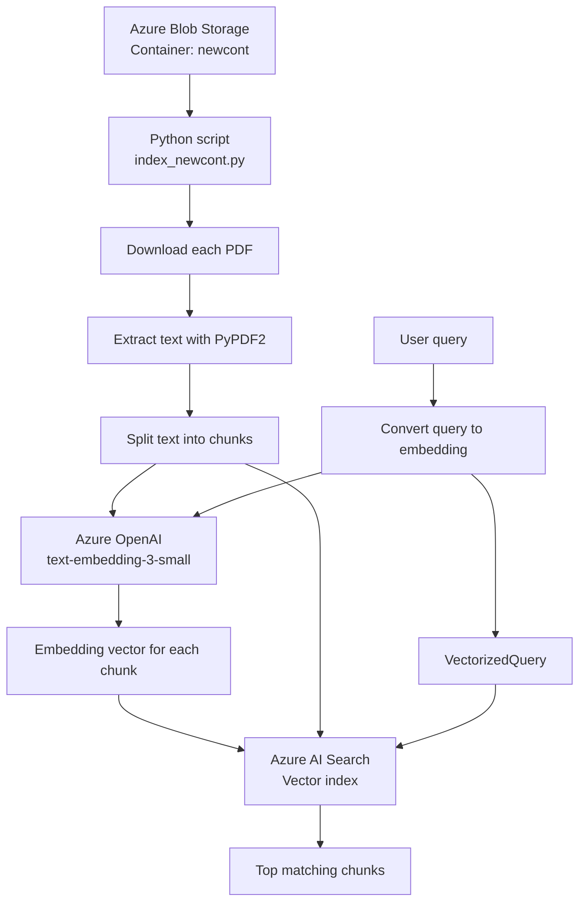

# Task 2: Resume Search over Azure Blob Storage

This task implements a push-based resume search pipeline using Azure services.

## What it does

- Reads PDF resumes from an Azure Blob Storage container
- Extracts text locally with `PyPDF2`
- Splits each resume into overlapping chunks
- Generates embeddings with Azure OpenAI
- Pushes chunk documents into Azure AI Search
- Runs vector similarity search over the stored chunks

## Architecture



## Files

- `index_newcont.py`: end-to-end indexing and search script
- `.env.example`: required environment variables
- `requirements.txt`: Python dependencies

## Setup

```bash
python -m venv .venv
.venv\Scripts\activate
pip install -r requirements.txt
copy .env.example .env
```

Update `.env` with your own:

- Azure AI Search endpoint and admin key
- Azure Blob Storage connection string
- Azure OpenAI endpoint, key, and embedding deployment name

## Run

```bash
python index_newcont.py
```

The script will:

1. Create or update the vector index
2. Read all PDFs from `newcont`
3. Upload vectorized chunks
4. Run a sample vector search query

## Notes

- This version uses vector search, not Azure semantic ranker.
- Do not commit your real `.env` file.
- If your embedding model changes, update `AZURE_OPENAI_EMBEDDING_DIMENSIONS` to match it.

